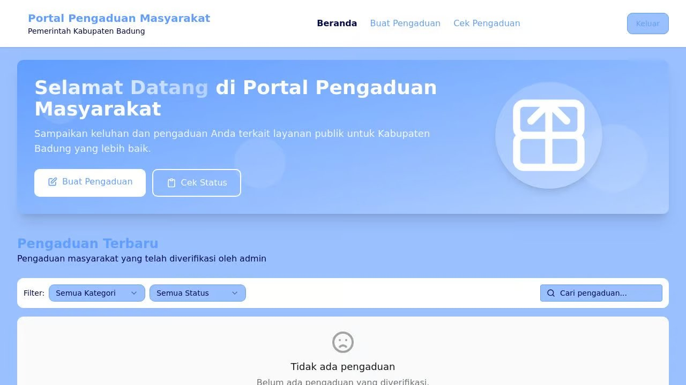
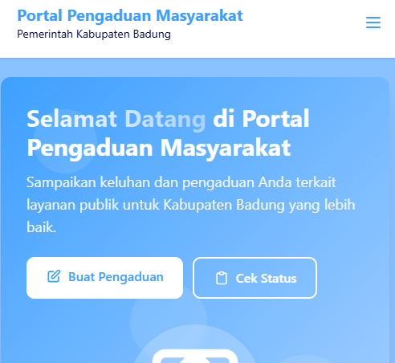
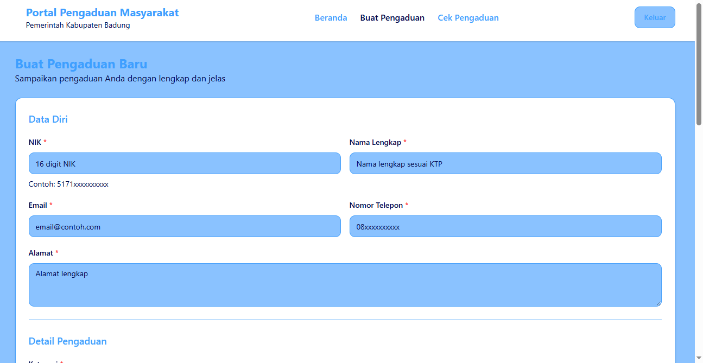
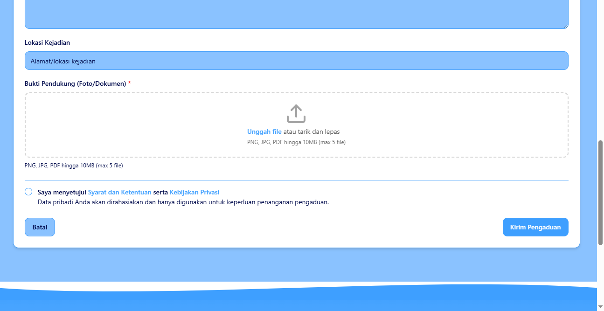

# Portal Pengaduan Masyarakat Pemerintah Kabupaten Badung








## Deskripsi Proyek

Portal Pengaduan Masyarakat adalah sistem pengelolaan pengaduan online untuk Pemerintah Kabupaten Badung. Aplikasi ini memungkinkan masyarakat untuk menyampaikan keluhan, pengaduan, dan aspirasi kepada pemerintah secara transparan dan efisien.


## Fitur Utama

### Untuk Masyarakat
- **Buat Pengaduan**: Masyarakat dapat mengajukan pengaduan dengan mengisi formulir lengkap
- **Unggah Lampiran**: Mendukung lampiran foto dan dokumen PDF sebagai bukti pendukung
- **Lacak Pengaduan**: Masyarakat dapat memantau status pengaduan menggunakan nomor pelacakan
- **Verifikasi Anonim**: Pengadu dapat memverifikasi status pengaduan tanpa membuka identitas
- **Umpan Balik**: Masyarakat dapat memberikan umpan balik atas respons pemerintah

### Untuk Admin
- **Dashboard Komprehensif**: Ringkasan visual data pengaduan dan statistik
- **Verifikasi Pengaduan**: Proses validasi untuk menguji keabsahan pengaduan
- **Pengelolaan Pengaduan**: Sistem pengaturan untuk mengelola pengaduan
- **Respons Pengaduan**: Kemampuan untuk menanggapi dan menyelesaikan pengaduan
- **Analisis Data**: Laporan dan analisis untuk mengidentifikasi tren pengaduan

## Teknologi yang Digunakan

### Frontend
- React dengan TypeScript
- Tailwind CSS untuk styling
- Shadcn UI untuk komponen antarmuka
- React Query untuk state management
- React Hook Form untuk pengelolaan formulir

### Backend
- Node.js dengan Express
- Drizzle ORM untuk interaksi database
- Zod untuk validasi data
- Express Session untuk manajemen sesi
- Passport.js untuk autentikasi

## Alur Pengaduan

1. **Pengguna Membuat Pengaduan**
   - Mengisi formulir dengan data pribadi dan detail pengaduan
   - Mengunggah foto atau dokumen pendukung
   - Menerima nomor pelacakan dan token akses

2. **Verifikasi oleh Admin**
   - Admin memeriksa keabsahan pengaduan
   - Pengaduan yang valid akan disetujui dan dipublikasikan (tanpa data pribadi)
   - Pengaduan yang tidak valid akan ditolak dengan alasan penolakan

3. **Penanganan Pengaduan**
   - Admin menetapkan status pengaduan (Dalam Proses, Ditindaklanjuti, dsb)
   - Admin memberikan tanggapan dan solusi atas pengaduan

4. **Transparansi dan Penutupan**
   - Masyarakat dapat melihat pengaduan yang telah diverifikasi dan tanggapannya
   - Pengaduan dapat ditutup setelah diselesaikan oleh admin
   - Masyarakat dapat memberikan umpan balik atas penanganan

## Cara Menjalankan Aplikasi

### Prasyarat
- Node.js versi 18.x atau lebih tinggi
- NPM versi 8.x atau lebih tinggi

### Langkah Instalasi

1. Clone repositori
   ```
   git clone [url-repositori]
   cd portal-pengaduan-badung
   ```

2. Instal dependensi
   ```
   npm install
   ```

3. Jalankan aplikasi dalam mode pengembangan
   ```
   npm run dev
   ```

4. Akses aplikasi di browser
   ```
   http://localhost:5000
   ```

## Kredensial Admin Demo
- Username: admin
- Password: admin123

## Kontak

Untuk pertanyaan lebih lanjut, silakan hubungi:
- Email: habizinnia@gmail.com

---